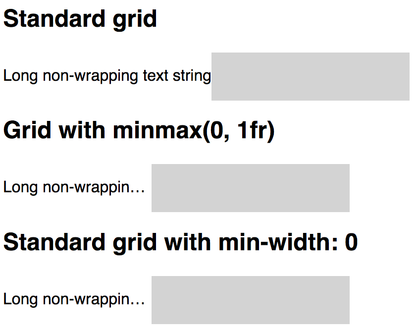

A couple gotchas I've found with CSS grid and fractional units

<!-- end -->

By using fractional units, the browser is responsible for figuring out the minimum size of the content of it's grid items.

```css
grid-template-columns: repeat(2, 1fr);
```
is roughly functionally equivalent to:
```css
grid-template-columns: repeat(2, minmax(auto, 1fr));
```

Meaning if the grid item's content size is greater than the available space the 'fractional unit' (1fr) can find, the grid item will not shrink to conform to the grid.

To solve this, set an explicit minimum width of the item in one of two ways:

```css
.grid {
  grid-template-columns: repeat(2, minmax(0, 1fr));
}
```
or
```css
.grid-item {
  min-width: 0;
}
```



[CSS Tricks - Preventing a Grid Blowout](https://css-tricks.com/preventing-a-grid-blowout/)
[Codepen](https://codepen.io/ajosedev/pen/OeERWQ?editors=1100)
